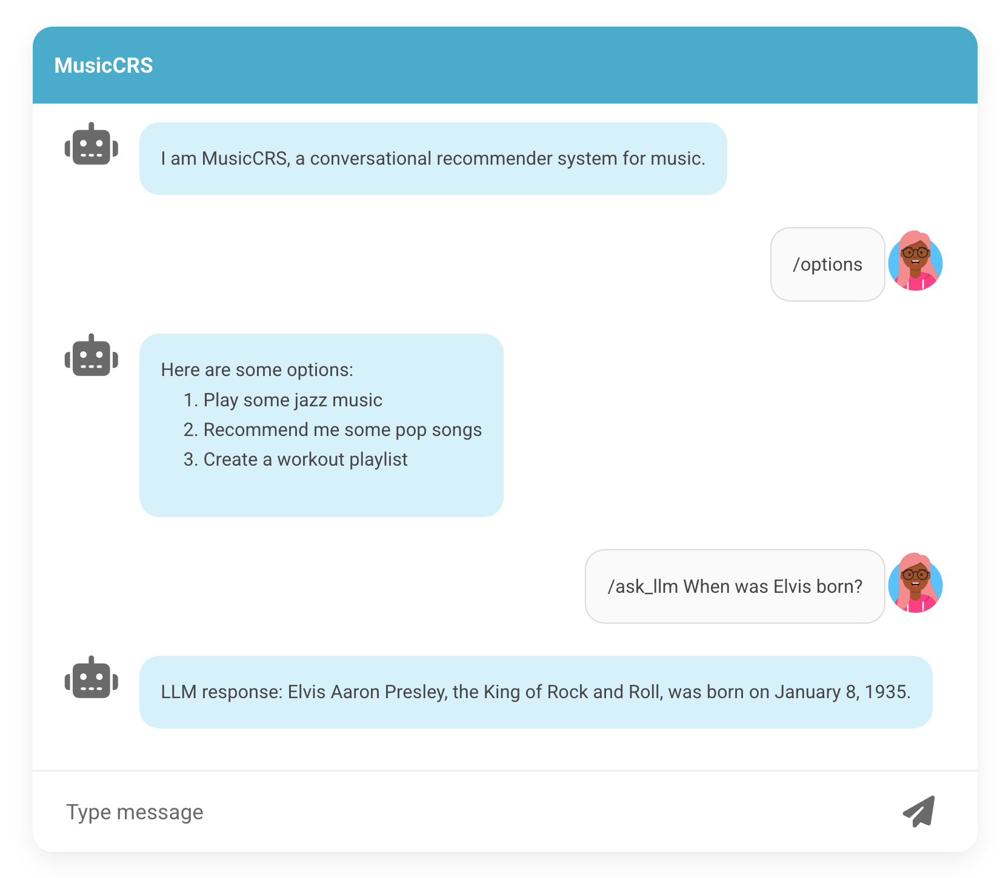

# DAT640-2025 MusicCRS starting package

This repository contains a starting package for the MusicCRS group project.

It has some basic functionality to provide static responses (type `/info`), display options to the user to choose from (`/option`), prompt a large language model (`/ask_llm [prompt]`) and terminate the conversation (`/quit`).



## Backend (Conversational Agent)

The code for the conversational agent is found under the [musiccrs](musiccrs/) folder. It is based on the [DialogueKit](https://github.com/iai-group/DialogueKit) toolkit and assumes **Python 3.11**.

Install dependencies by running:

```bash
pip install -r requirements.txt
```

Then, start the server by running:

```bash
python musiccrs/musiccrs.py
```

The server will be running on <http://127.0.0.1:5000>.

Leave the terminal open to keep the server running. Open a new terminal window to set up and start the frontend.

## Frontend

The [frontend](frontend/) is based on [ChatWidget](https://github.com/iai-group/ChatWidget).

**You are allowed to make any changes and customizations to the frontend.**

Install Node if you don't have it from [here](https://nodejs.org/en/download/).

Then install all necessary packages:

```bash
frontend/$ npm install
```

This should generate `node_modules` folder.

To run the app in the development mode, use the following command:

```bash
npm start
```

Open [http://localhost:3000](http://localhost:3000) to view it in the browser.

This should automatically launch the client in your browser, and the client should be able to communicate with the server.

The page will reload if you make edits.
You will also see any lint errors in the console.

## Structuring responses

Use the `AnnotatedUtterance` class in Python to when sending responses from the agent.
Minimally, it contains the text of the message and specifies the sender:

```python
utterance = AnnotatedUtterance(
            "This is something the agent is saying",
            participant=DialogueParticipant.AGENT,
        )
```

Optionally, it can also provide a dialogue act with annotations. For example, there is a built-in dialogue act in DialogueKit for indicating that the chat is terminated:

```python
utterance = AnnotatedUtterance(
            "It was nice talking to you. Bye",
            dialogue_acts=[DialogueAct(intent=self.stop_intent)],
            participant=DialogueParticipant.AGENT,
        )
```

On the client side, annotated utterances are received as JSON dictionaries. E.g., the message with the stop intent is encoded as:

```json
{
  "sender": "MusicCRS",
  "message": {
    "text": "It was nice talking to you. Bye",
    "dialogue_acts": [
      {
        "intent": "EXIT",
        "annotations": []
      }
    ]
  }
}
```

You may introduce specific intents for certain functionality, which may require special handling on the frontend (or help the simulator interact automatically with your agent). In our example, we use a specific intent when presenting the user with a set of options to choose from. The specific options can also be marked up as annotations.

```python
utterance = AnnotatedUtterance(
                "Here are some options: [...]",
                participant=DialogueParticipant.AGENT,
                dialogue_acts=[
                    DialogueAct(
                        intent=_INTENT_OPTIONS,
                        annotations=[
                            SlotValueAnnotation("option", option) for option in options
                        ],
                    )
                ],
            )
```

Then, the specific options will also be passed on as annotations:

```json
{
  "sender": "MusicCRS",
  "message": {
    "text": "Here are some options: [...]",
    "dialogue_acts": [
      {
        "intent": "OPTIONS",
        "annotations": [
          {"slot": "option", "value": "Play some jazz music"},
          {"slot": "option", "value": "Recommend me some pop songs"},
          {"slot": "option", "value": "Create a workout playlist"}
        ]
      }
    ]
  }
}
```

Similarly, you may mark up certain entities in the text, such as artists or tracks as annotations, and display them differently (e.g., link them) in the chat.

```python
utterance = AnnotatedUtterance(
                "How about adding TRACK_NAME to the playlist?",
                participant=DialogueParticipant.AGENT,
                dialogue_acts=[
                    DialogueAct(
                        intent=_INTENT_RECOMMEND_TRACK,
                        annotations=[
                            SlotValueAnnotation(
                                "track",
                                value="https://api.spotify.com/v1/tracks/...",
                                start=17,
                                end=27,
                            )
                        ],
                ]
            )
```

## Using an LLM

You may utilize a large language model (LLM) for implementing the desired functionality. **Note that there is a single LLM call allowed for each agent response.**

All teams need to use the same LLM, [Llama-3.3-70B](https://ollama.com/library/llama3.3:70b), which is hosted on the Unix network at UiS on a dedicated GPU server. (For development, you may use a smaller Llama-3.x model hosted locally on your machine.)

  - To get access, first register at <https://openwebui.ux.uis.no>, using your student number and password for login
  - Once approved, generate an API token by going to `Settings` -> `Account` and generate a key

You can test the model using `curl` to send a prompt:

```bash
curl https://ollama.ux.uis.no/api/generate \
  -H "Authorization: Bearer YOUR_API_KEY_HERE" \
  -H "Content-Type: application/json" \
  -d '{
    "model": "llama3.3:70b",
    "prompt": "What is the capital of Norway?",
    "stream": false
  }'
```

Use the ollama client library to generate text programmatically from Python:

```python
from ollama import Client

client = Client(
            host=host,
            headers={"Authorization": f"Bearer {YOUR_API_KEY_HERE}"},
        )
client = Client(host="http://ollama.ux.uis.no")

# Generate a single completion
response = client.generate(
    model="llama3.3:70b",
    prompt="What is the capital of Norway?",
    options={
      "stream": False,
      "temperature": 0.7,  # optional: controls randomness
      "max_tokens": 100, # optional: limits the length of the response
    }
)
print(response["text"])
```
